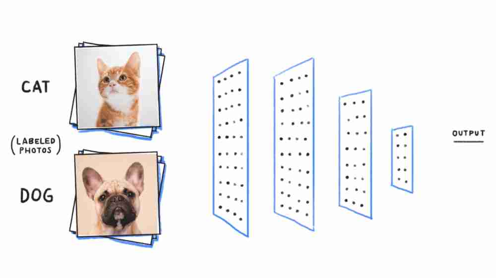

# *Flask Web App Classifier Machine Learning*

<br>
<br>
*Flask web app classifying cat vs dog object given image by user. It is quite simple layout of html & css. I just tried with simple task that was a learning steps. Anyone can develop it further.*

>make sure your are in the downloaded or cloned directory. You should find similar to these
```bash
$ ls -l

total 2
-rw-r--r-- 1 User 197121 263 Aug 15 23:03 app.py
drwxr-xr-x 1 User 197121   0 Aug 15 23:09 Images/
drwxr-xr-x 1 User 197121   0 Jul 29 08:14 pets/
-rw-r--r-- 1 User 197121  84 Aug 15 23:12 readme.md
drwxr-xr-x 1 User 197121   0 Jul 29 08:14 templates/
```
>now run the app.py file:
```bash
$ python app.py

* Serving Flask app "app" (lazy loading)
* Environment: production
WARNING: This is a development server. Do not use it in a production deployment.
Use a production WSGI server instead.
* Debug mode: off
* Running on http://127.0.0.1:5000/ (Press CTRL+C to quit)
```
>copy the path and open a browser,paste the url.. Good to go.

## Get touch with me
Connect- [linkedin](https://linkedin.com/in/rakibhhridoy)
Website- [RakibHHridoy](https://rakibhhridoy.github.com) 